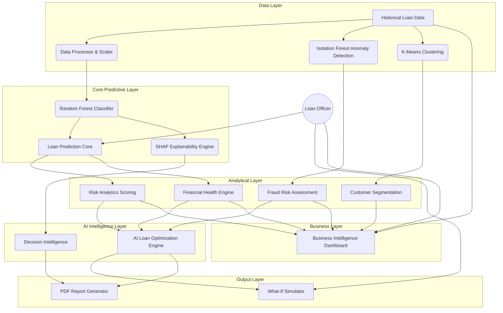

# Architecture Diagram

The Loan Decision Support Platform is structured as a 10-phase integrated enterprise application.

## Module Definitions
1. **Business Intelligence Dashboard**: Macro-level portfolio aggregation and executive KPIs.
2. **Loan Prediction**: The primary entry point for individual applicant evaluation.
3. **Dataset Insights**: Raw exploration of the underlying training data distributions.
4. **Risk Analytics**: Credit and demographic risk stratification.
5. **Financial Health**: Debt-to-Income and affordability analysis.
6. **What-If Simulator**: Real-time manipulation of features to see outcome shifts.
7. **Decision Intelligence**: Transparent AI reasoning mapping exact SHAP value impacts.
8. **Customer Segmentation**: Unsupervised clustering assigning applicants to 5 distinct personas.
9. **AI Loan Optimization**: Algorithmic goal-seeking to rescue rejected applicants with restructured terms.
10. **Fraud Risk Assessment**: Dual-layer heuristic and anomaly detection for risk mitigation.
